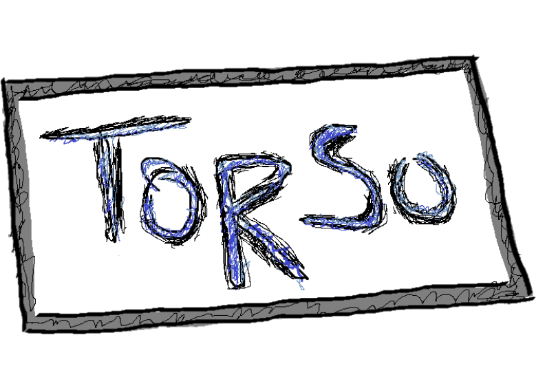

# Torso

## Description

Torso is a first-person RPG horror adventure game.

## Features

- **Fluid Movement and Gunplay**: Enjoy a gameplay experience focused on responsive controls, providing a satisfying feeling of movement and intense gunplay.
- **Creepy Early 2000s Horror Game Art Style**: Immerse yourself in a visually striking world that pays homage to the unsettling aesthetics of classic horror games from the early 2000s.
- **Gore and Ragdolling**: Experience realistic and visceral gore effects and witness ragdoll physics that add an extra layer of immersion and horror to your encounters.
- **Fleshed Out Inventory System**: Manage your resources effectively with a comprehensive inventory system, allowing you to collect and utilize various items and weapons to survive.
- **Terrifying Monsters, Human or Otherwise**: Encounter a variety of terrifying monsters, each with their own unique abilities and behaviors, adding complexity and challenge to your journey.
- **Intuitive Map Design**: Navigate through meticulously crafted environments with intuitive map design, ensuring a seamless and immersive experience as you explore the dark corners of Torso's world.
- **Hardcore Mechanics**: Test your skills and perseverance with elements of hardcore mechanics and a challenging difficulty level, providing a rewarding experience for players seeking a true horror adventure.
## Contact

For any inquiries or questions, feel free to reach out to the development team at [jbeatt202@caledonian.ac.uk].

